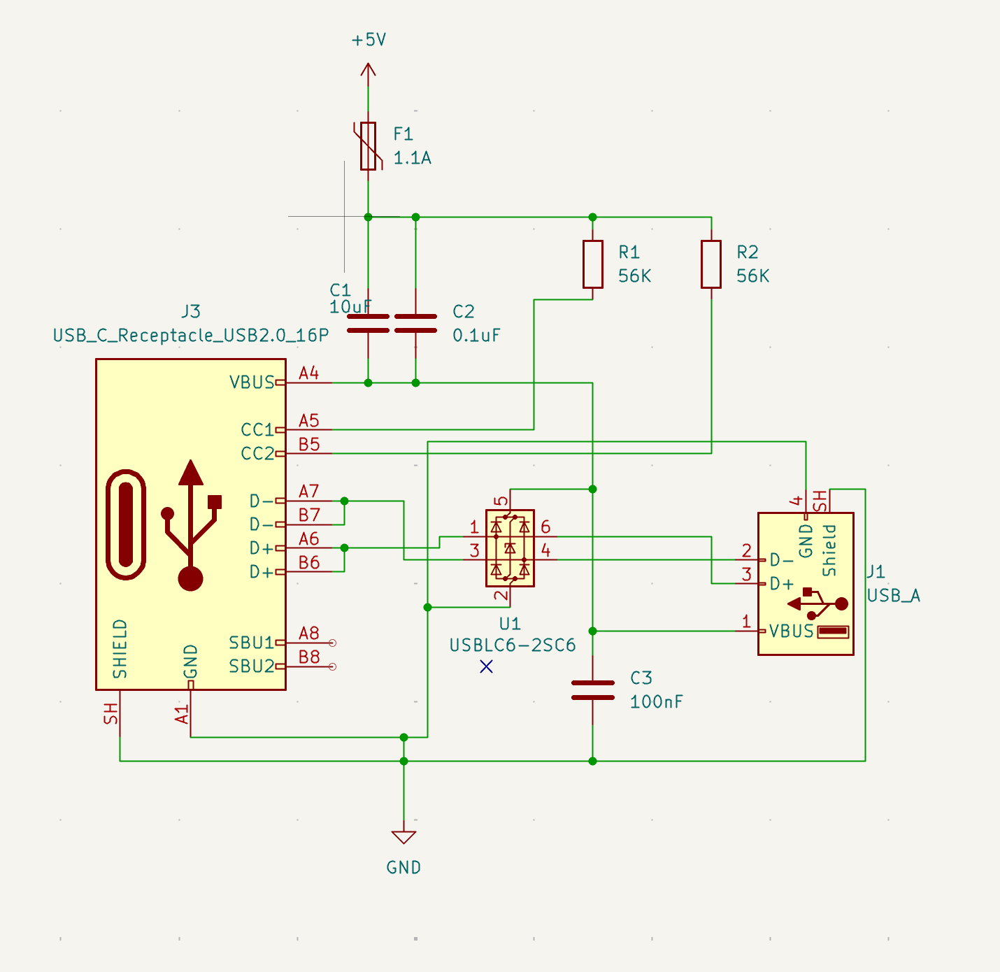
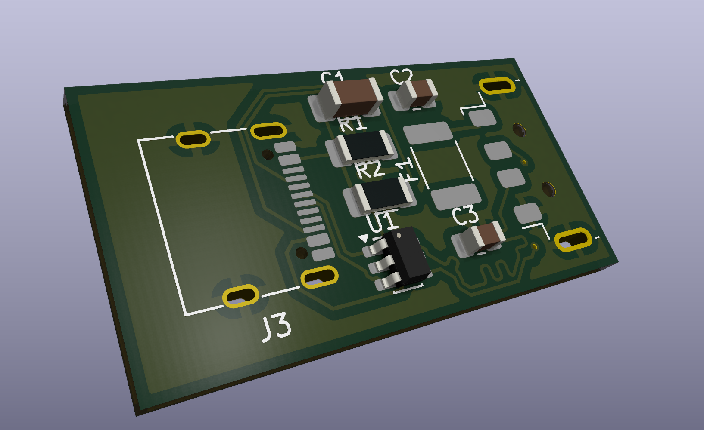

# USB C Receptacle to USB A Plug Adapter
>Work in Progress
**USBC to A Adapter (USB2.0) with 2-layers PCB**

This is my hobby project for practicing circuit design and PCB design skills
 
 

## Schematic

## PCB

>_AI used in this project -> Gemini 3.7 flash (For suggest method how to design a schematic)_
